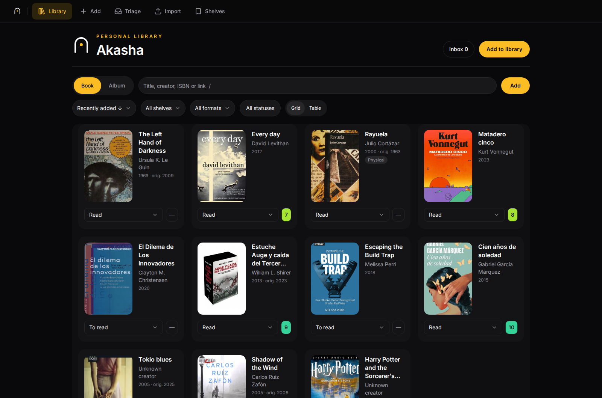
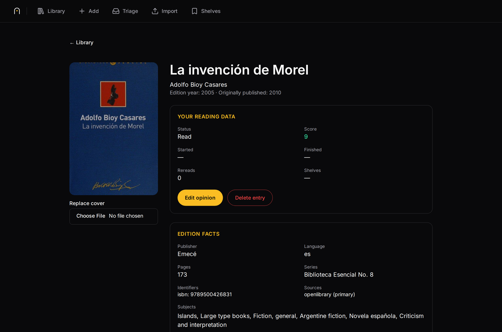

<div align="center">

<picture>
  <source media="(prefers-color-scheme: dark)" srcset="docs/brand/source/mark-on-dark.svg">
  
</picture>

# Akasha

**A self-hosted library for your thoughts.**

[](LICENSE)
[](SECURITY.md)
[](backend/pyproject.toml)
[](frontend/package.json)

</div>

<br>



---

## What it is

You add a book or a record, score it out of ten, write a note, put it on a shelf.
Reading trackers optimise for other people seeing your opinions and their vendors selling you stuff;
this optimises for you remembering, three years later, whether something was any good.

Akasha is domain agnostic, it's built so you can extend it to hold information on anything you enjoy,
but today it supports Books and Albums. See [Domains](#domains-and-stack) for more info.

> [!WARNING]
> **v1 has no authentication of any kind.** Anyone who can reach the port can read
> and change everything. Run it on a trusted LAN, never on the public internet.
> See [SECURITY.md](SECURITY.md) for the full threat model.

## What it does

- **One box for multiple domains.** Akasha reaches the web for public APIs
(Open Library, Google Books, MusicBrainz) to find any piece of media you are thinking of.
Paste a URL or an ISBN and it resolves that instead of guessing.
- **Record your opinion.** Give it a score out of ten, leave notes if you have them.
Did you drop the book halfway through? Do you want to buy this album in vinyl some day?
Add your item to a shelf and give it a status.
- **Import your library** Importing from existing systems is supported and extensible.
Bring your own Goodreads CSV, a read-only Calibre library and get your info migrated.
- **Choose your covers.** If provided by the API, or upload your own, you can choose the how your items look
What you see in the app should reflect what's in your house.
- **Upload your files** While not its primary feature, you can attach files to entries,
in case you need a safe place to store that PDF.

<details>
<summary><b>An entry's detail page</b></summary>



</details>

## Importing and triage

Use **Import** when you already have a book library in Goodreads or Calibre. The
screen has one tab per connector plus **Triage**, because triage is where an import
ends rather than a separate destination: it is empty until something lands in it.

Each connector explains itself on its own tab. Goodreads tells you where the export
lives (`goodreads.com/review/import` → Export Library, desktop web only), that it is
a snapshot rather than a sync, and what happens to your ratings; drop the CSV on the
tab or choose it.

**Calibre needs no setup at all: choose your library folder and your browser reads it.**
There is nothing to mount, no `CALIBRE_DIR`, and no restart. By default only `metadata.db`
and the covers are sent — your ebooks stay on your machine, which is why a 174 MB library is
about 10 MB of upload. If you turn on **Also attach the ebook files**, the screen selects one
file per book (epub first, then azw3, mobi, pdf, cbz, cbr or txt), counts and sizes them before
anything moves, and attaches them after you commit the preview. The toggle is off by default.

**Re-syncing is cheap.** Before uploading, Akasha asks itself which books it already
holds and sends only what is missing, so importing the same folder again moves about a
megabyte instead of the whole thing — measured at 10.55 MB for a first import and
0.99 MB for an unchanged re-sync of the same 18-book library. Add one book and only that
book's cover travels. If the check fails for any reason, everything is sent and the
screen says so, so a re-sync is never worse than it used to be. Nothing is written back to Calibre and nothing holds the library open, so it
is safe to do while Calibre or calibre-web is running.

Ebook uploads are one request per book, with visible progress. A file above the 25 MiB
attachment cap is named and left on your machine; a failed file is named without failing the
rest of the import. A second sync sends no ebook Akasha already holds, and deleting one imported
attachment makes only that file eligible again. Undo removes files that batch attached but
retains anything you renamed, replaced or attached by hand. The measured disk cost is 95 MB for
this 18-book library, or roughly 3.2 GB for 600 books at the same mean; nightly backups reuse blob
inodes only while the backup and data directories share a filesystem.

If instead the library is somewhere the server can already see, the same tab offers
that underneath: mount it, browse to the folder that holds `metadata.db`, and the screen
confirms it found one. Typing a relative path still works, for scripts. That path has no
upload ceiling, which is what a library too large for a browser should use.

Every import starts with a preview: you can inspect errors and settle ambiguous
matches before Akasha changes anything. A committed row enters Triage as `unsorted`,
and the ordinary library view deliberately hides unsorted entries, so the Triage tab
is where an import actually shows up. When a source cannot be read, the connector
says what to do about it — a locked Calibre database asks you to close Calibre and
try again.

Re-running a source is useful when that source has changed. The source fingerprint
makes an unchanged replay harmless. A Calibre re-sync can fill metadata that is still
empty, but it never overwrites a value you have edited in Akasha; your corrections
always win. A committed batch can be undone from the completion screen for 24 hours,
while its audit record remains durable after that window.

Import connectors are domain-owned and registry-driven, and a connector publishes its
own guidance, its own input affordances and its own error vocabulary. Goodreads and
Calibre ship for books today; contributors can add another connector without changing
the shared preview, commit, triage or undo pipeline — and without editing this screen.
See [how to add a domain and importer](docs/guides/adding-a-domain.md).

## Quick start

You need Docker with the Compose plugin

```bash
git clone https://github.com/mauroibz/akasha.git
cd akasha

cp .env.example .env
$EDITOR .env                              # set USER_AGENT_CONTACT to a real address

mkdir -p calibre
docker compose up -d
```

Open `http://localhost:8000`.

`USER_AGENT_CONTACT` is required — Open Library asks callers to identify themselves,
and startup refuses without it.

`data` and `backups` are named Docker volumes, seeded from the image with the right
ownership already on them. Want them as real host directories instead (a NAS-backed `BACKUP_DIR`, direct access to the sqlite
file)? See [Bind-mounting data and backups](#bind-mounting-data-and-backups).

### Configuration

Everything is environment variables, all documented in [`.env.example`](.env.example).

| Variable               | Default          | What it does                                                                               |
| ---------------------- | ---------------- | ------------------------------------------------------------------------------------------ |
| `USER_AGENT_CONTACT`   | *required*       | Contact address sent to metadata providers                                                 |
| `GOOGLE_BOOKS_API_KEY` | *empty*          | Optional. Without it, search uses Open Library alone and Spanish-language coverage is poor |
| `AKASHA_DATA_VOLUME`   | `akasha_data`    | Docker volume name for the database, covers and attached files                             |
| `AKASHA_BACKUP_VOLUME` | `akasha_backups` | Docker volume name for backups, deliberately outside the data volume                       |
| `CALIBRE_DIR`          | `./calibre`      | Your Calibre library, mounted read-only                                                    |
| `AKASHA_PORT`          | `8000`           | Published port                                                                             |
| `AKASHA_BIND`          | `0.0.0.0`        | Set to `127.0.0.1` to keep it off the network                                              |
| `TZ`                   | `UTC`            | Timezone                                                                                   |
| `LOG_LEVEL`            | `INFO`           | Log verbosity                                                                              |

Check which providers are live:

```bash
curl -s localhost:8000/api/health/providers
```

### Bind-mounting data and backups

`data` and `backups` are named Docker volumes by default. Prefer real host directories
— a NAS-backed `BACKUP_DIR`, or direct host access to the sqlite file? Opt into
[`compose.bind-mounts.yaml`](compose.bind-mounts.yaml), which mounts them as real host
directories instead, with one extra requirement:

```bash
mkdir -p data backups
sudo chown -R 10001:10001 data backups   # the container runs as uid 10001
docker compose -f compose.yaml -f compose.bind-mounts.yaml up -d
```

Use the same two `-f` flags on every later `docker compose` command for this stack.

### Backups

Take one now, or schedule it nightly:

```bash
./scripts/backup.sh                                                       # now
15 3 * * *  cd /srv/akasha && ./scripts/backup.sh >> /var/log/akasha-backup.log 2>&1  # nightly, host crontab
```

Each run backs up the live database through SQLite's own backup API, archives covers,
hardlinks attached files so a week of backups costs about one copy, checksums and
verifies itself, and keeps the last `BACKUP_RETENTION` nights. An upgrade takes its own
backup first and refuses to migrate if it can't.

Restore, rollback and reverse-proxy guidance are in
**[the operator runbook](docs/operations/runbook.md)**.

## Documentation

[`docs/README.md`](docs/README.md) is the map, and says whether each document is
canonical, historical or a proposal. Product behaviour is canonical in the
[product spec](docs/specs/product-spec.md); architecture and contracts in the
[technical spec](docs/specs/technical-spec.md); every material decision, with its
reasoning, in [`docs/decisions.md`](docs/decisions.md). Visual identity — palette,
type, the mark — is in [`docs/brand/`](docs/brand/).

Akasha was built by following the [Seeds](https://github.com/mauroibz/seeds) methodology for agentic development.
The sprint files, decision log and worklog in `docs/` are the real record of that,
mistakes included.

## Development

You need Node 22, npm, and [`uv`](https://docs.astral.sh/uv/). `uv` installs Python
3.12 itself.

```bash
make bootstrap
cp .env.example .env

make dev-backend    # terminal 1 — API at http://localhost:8000
make dev-frontend   # terminal 2 — UI at http://localhost:5173
```

| Command                | What it does                                                                                                                                           |
| ---------------------- | ------------------------------------------------------------------------------------------------------------------------------------------------------ |
| `make check`           | Format check, lint, types, project state, OpenAPI drift                                                                                                |
| `make test`            | Backend and frontend unit tests                                                                                                                        |
| `make format`          | Apply formatting                                                                                                                                       |
| `make build`           | Python wheel and production SPA                                                                                                                        |
| `make migrate`         | Upgrade the configured database                                                                                                                        |
| `make smoke-container` | Full container proof: healthcheck, non-root, persistence across recreation, every asset chunk, read-only Calibre, backup and restore, graceful SIGTERM |
| `npm run test:e2e`     | Playwright, in `frontend/` — dev server *and* a real production build                                                                                  |

### Domains and stack

FastAPI, SQLAlchemy, Alembic and SQLite on the backend; React 18, Vite, TypeScript,
Tailwind, shadcn/ui and TanStack Query on the frontend. One container, one process,
one SQLite file.

A **domain** is a kind of thing the library holds — a book, an album. Each lives in its
own package under `backend/src/book_tracker/domains/`, declaring its fields, statuses,
formats, identity rule and provider; that declaration is served over the API and every
screen renders from it, so nothing above the registry branches on type. Adding one
costs a package, a registry entry and provider wiring: no migration, no edit to
another domain's files. See **[how to add a domain](docs/guides/adding-a-domain.md)**,
binding contract in [technical spec §6.6](docs/specs/technical-spec.md).

## Contributing

Issues and pull requests are welcome. **[`CONTRIBUTING.md`](CONTRIBUTING.md)** has the
setup and the gates. Provider fixtures in `backend/tests/fixtures/providers/` are
pinned recordings of real API responses — never re-record one to make a test pass,
that turns a regression test into a rubber stamp.

## License

[GNU AGPL v3](LICENSE). Run, modify and share Akasha freely, including inside an
institution. Redistributing it, or running a modified version as a network service,
requires publishing your source under the same licence — for hosting or redistribution
without that obligation, see [COMMERCIAL-LICENSE.md](COMMERCIAL-LICENSE.md).
